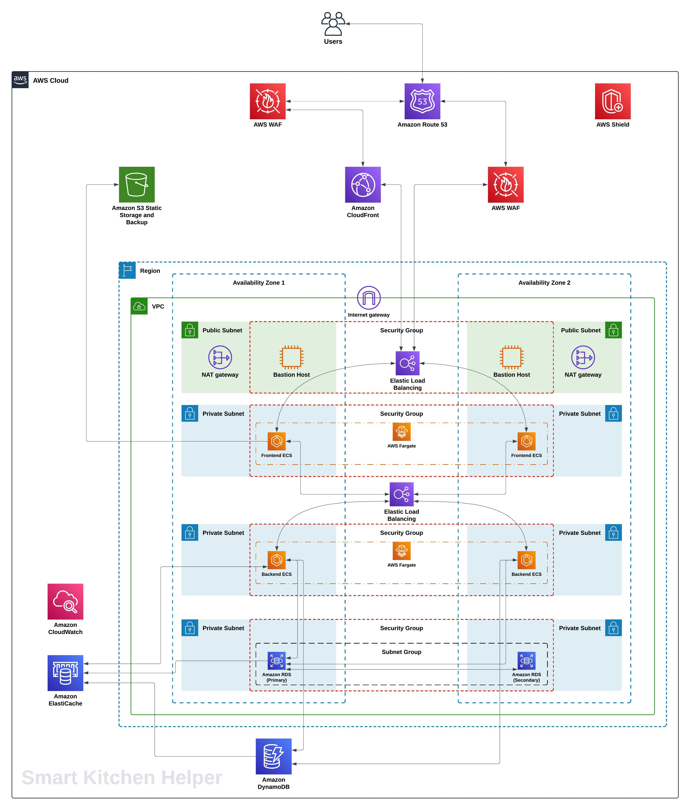
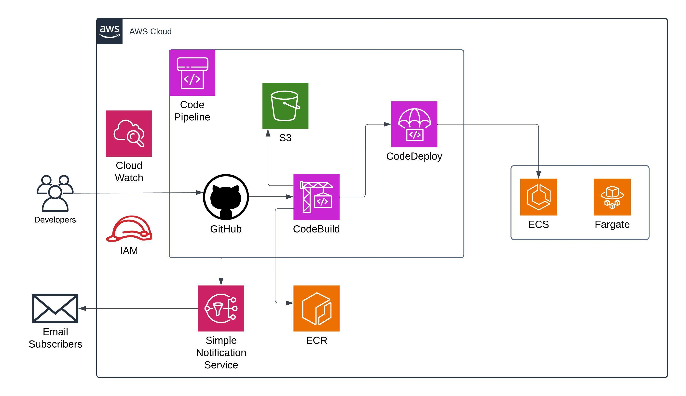

# 🧠 SmartKitchenHelper - Cloud Infrastructure (Terraform)

This repository contains the Terraform code that provisions the cloud infrastructure for **SmartKitchenHelper**, a cloud-based kitchen management platform developed as the final capstone project for the Cloud Computing course at **Durham College**.

SmartKitchenHelper is designed to minimize food waste, simplify meal planning, and support multi-household kitchen inventory management using a scalable and secure AWS cloud architecture.

## 📊 Project Overview

SmartKitchenHelper is a full-stack cloud-native application with:

- Real-time ingredient tracking
- Personalized recipe recommendations
- Multi-household inventory management
- Dual-database integration (PostgreSQL + MongoDB)
- Secure JWT-based authentication and RBAC

This repository focuses on the **Infrastructure as Code (IaC)** part using Terraform to provision the backend cloud infrastructure on **Amazon Web Services (AWS)**.

---

## 🏗 Architecture Highlights

- ✅ **VPC Setup** with Public and Private Subnets across multiple Availability Zones (AZs)
- 🌐 **Internet Gateway**, **NAT Gateway**, **Route Tables**
- 🛡️ **Security Groups** for granular network access control
- 📦 **Elastic Container Service (ECS)** for Dockerized frontend & backend apps
- 📚 **RDS PostgreSQL** for structured data and **MongoDB Atlas** for unstructured data
- 📁 **S3** for static assets and CI/CD artifacts
- 🚀 **Load Balancers (ALB)** for frontend and backend services
- 🔁 **CI/CD Pipeline** with CodePipeline & CodeBuild for continuous deployment

---

## 🛠 AWS Services Used

| Category           | Services                                  |
|-------------------|-------------------------------------------|
| Compute           | Amazon ECS (Fargate)                      |
| Networking        | VPC, Subnets, Internet/NAT Gateways, ALBs |
| Storage           | Amazon S3                                 |
| Databases         | Amazon RDS (PostgreSQL), MongoDB Atlas    |
| Monitoring        | AWS CloudWatch                            |
| CI/CD             | AWS CodePipeline, CodeBuild               |
| IAM & Security    | IAM, Security Groups, JWT, RBAC           |

---

## 🔐 Security & Best Practices

- 🔑 **JWT-based User Authentication**: Secure stateless authentication using signed tokens.
- 👥 **Role-Based Access Control (RBAC)**: Granular user permissions based on roles (e.g., admin vs general user).
- 🔒 **Encrypted Data**: All sensitive data is encrypted both at rest (e.g., in RDS) and in transit (e.g., HTTPS).
- 🌐 **Multi-AZ RDS Deployment**: PostgreSQL database is deployed across multiple availability zones for fault tolerance and high availability.
- 📊 **CloudWatch Monitoring**: Real-time performance monitoring and logging for infrastructure visibility and proactive debugging.

---

## 🗺️ Architecture Diagram

### Cloud Infrastructure Diagram


### CI/CD Pipeline Diagram


---

## 🚀 How to Deploy

### Prerequisites

- AWS CLI configured with credentials
- [Terraform](https://developer.hashicorp.com/terraform/downloads)
- Docker (if testing locally)

### Deployment Steps

```bash
# Clone the repository
git clone https://github.com/<your-username>/smart-kitchen-infra.git
cd smart-kitchen-infra

# Initialize Terraform
terraform init

# Review the plan
terraform plan

# Apply the infrastructure
terraform apply
```
---

## 🧹 Cleanup

To destroy all infrastructure and avoid charges:

```bash
terraform destroy
```
---

## 🚧 Limitations or Known Issues

- MongoDB Atlas is not provisioned via Terraform yet and must be configured manually.
- Secrets (e.g., DB credentials) are currently hardcoded; integrating AWS Secrets Manager is recommended for production use.
